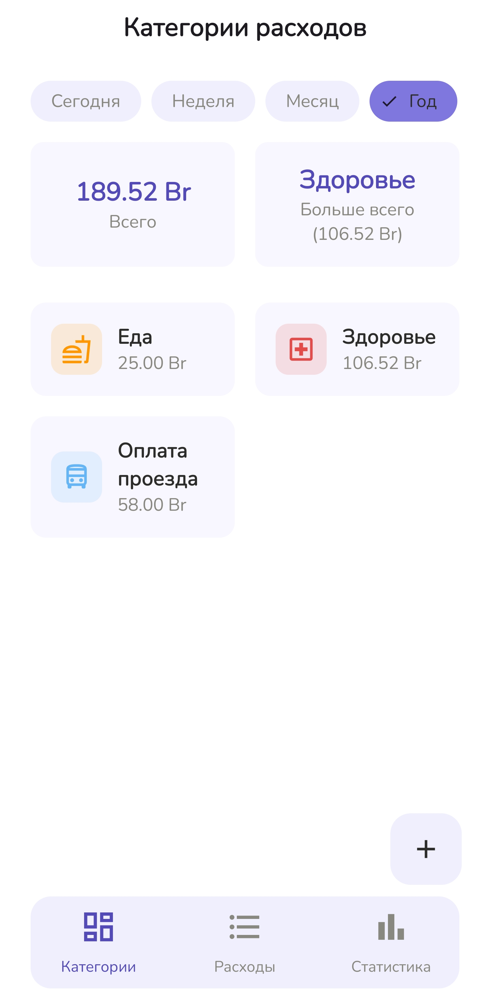
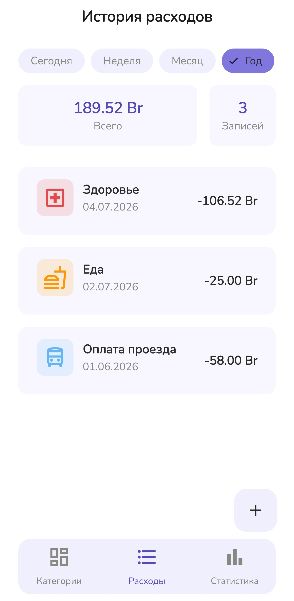
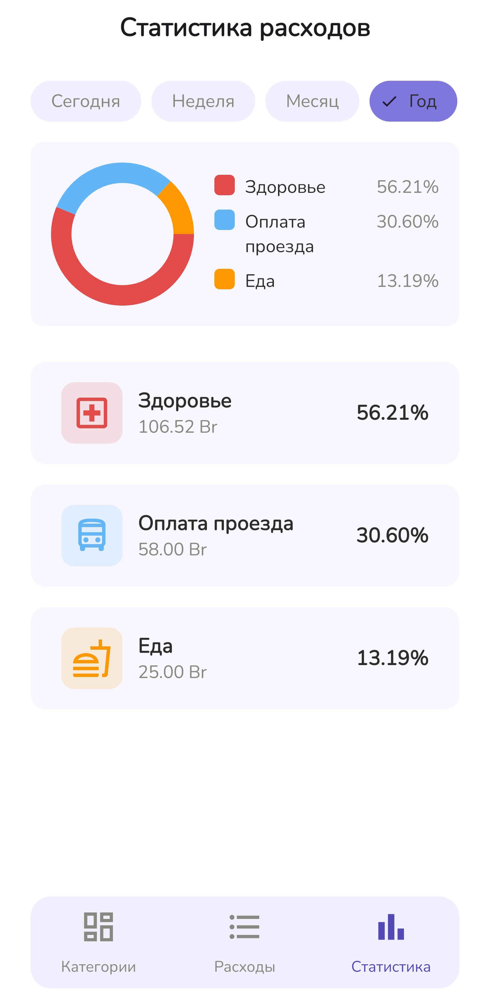
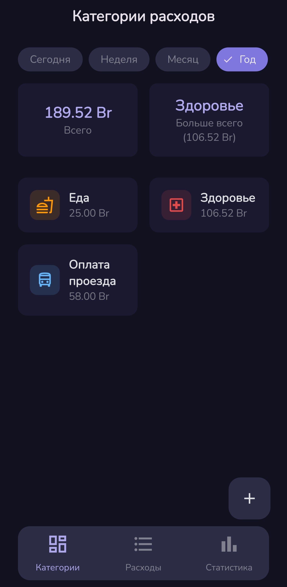
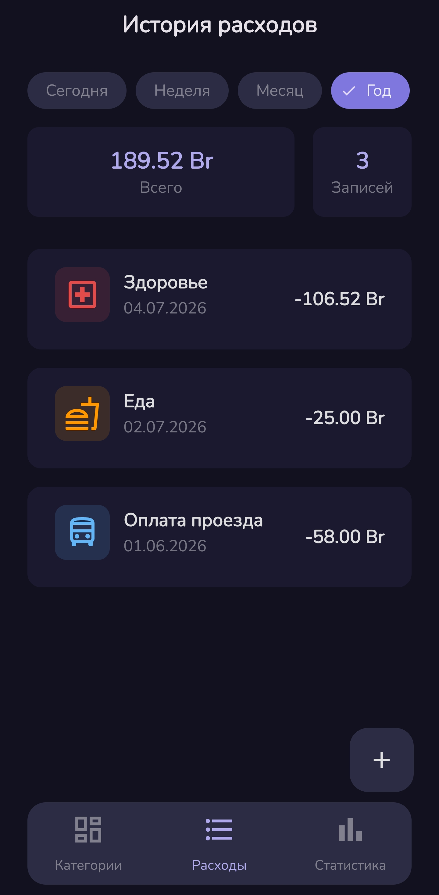
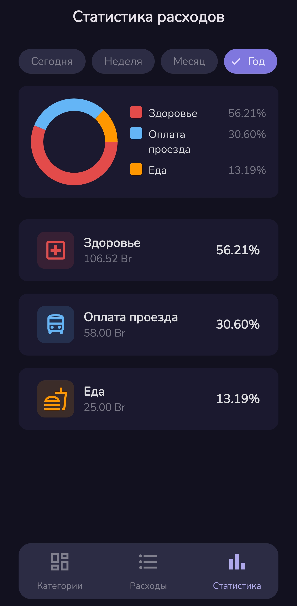
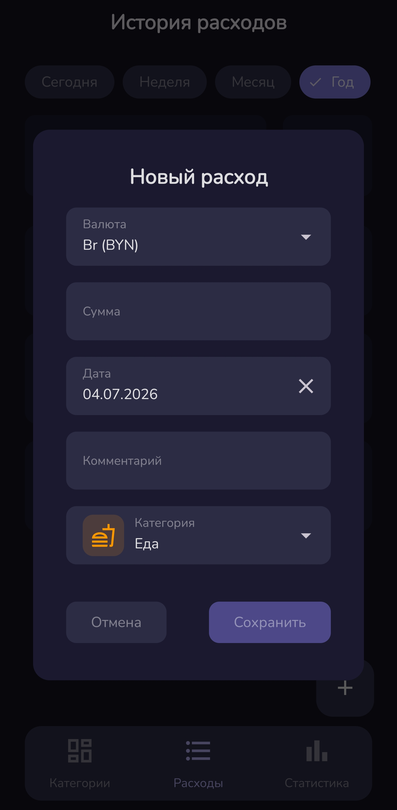
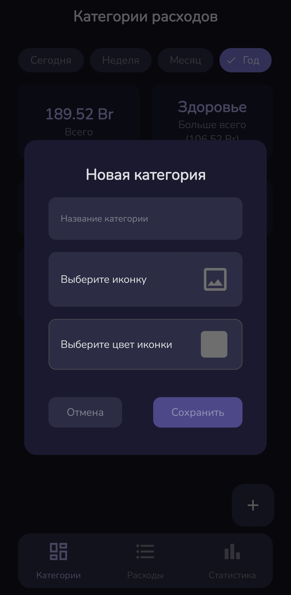
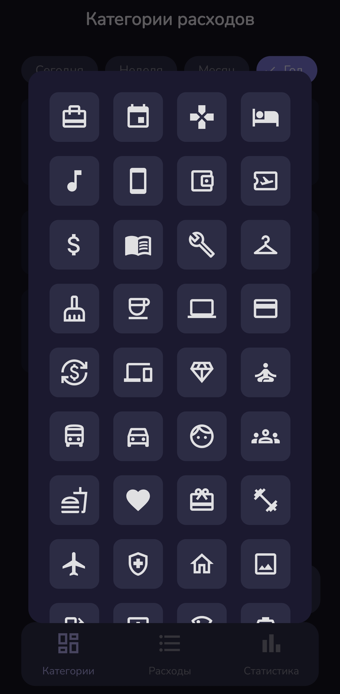
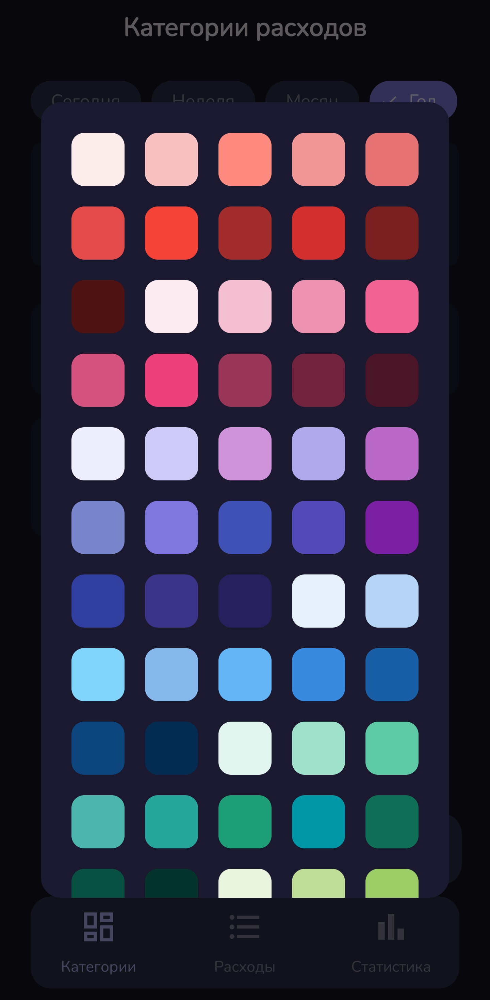

# Expense Tracker

Приложение для учёта личных расходов с категориями, аналитикой и поддержкой тёмной/светлой темы.
---

## Скриншоты

| Категории | История | Аналитика |
|-----------|---------|-----------|
|  |  |  |

<details>
<summary>Тёмная тема</summary>

| Категории | История | Аналитика |
|-----------|---------|-----------|
|  |  |  |

</details>

<details>
<summary>Диалоги</summary>

**Управление расходами**



**Управление категориями**

| Добавить категорию | Выбор иконки | Выбор цвета |
|-------------------|-------------|------------|
|  |  |  |

</details>

---

## Возможности

- **Категории** — создание категорий с выбором иконки и цвета, отображение суммы расходов по каждой категории
- **История** — список расходов за выбранный период времени
- **Аналитика** — donut-диаграмма и разбивка по категориям
- **Фильтр по периоду** — сегодня, неделя, месяц, год
- **Валюты** — выбор валюты для каждого расхода и перевод с помощью [ExchangeRate-API](https://www.exchangerate-api.com/docs/overview)
- **Тёмная и светлая тема** — следует системной настройке

---

## Стек

|  | Технологии |
|------|-----------|
| UI | Jetpack Compose |
| Архитектура | MVVM, Clean Architecture |
| DI | Hilt |
| База данных | Room |
| Навигация | Navigation Compose |
| Диаграммы | ComposeCharts |
| Async | Kotlin Coroutines, Flow |
| Работа с сетью | Retrofit |

---

## Архитектура

```
app/
├── data/
│   ├── api/                    # внешний API
│   ├── models/
│   │   └── relations/          # связи между таблицами Room
│   └── repository/             # реализации репозиториев
├── di/                         # Hilt модуль
├── domain/
│   ├── entities/               # модели уровня Domain
│   └── useCases/
└── presentation/
    ├── components/             # переиспользуемые Compose компоненты
    ├── navigation/             # Navigation Compose: граф навигации
    ├── screens/
    │   ├── categories/         # экран категорий
    │   ├── expenses/           # экран истории расходов
    │   └── statistics/         # экран аналитики
    └── ui.theme/               # Material Theme, цвета, типографика
```

Поток данных:
`UI → ViewModel → UseCase → Repository → Room → StateFlow → UI`

**Shared ViewModel для фильтра периода времени.** Три экрана (категории, история, статистика) показывают данные за один и тот же период. Вместо того чтобы передавать фильтр через навигацию или хранить в каждой ViewModel отдельно — используется одна `SharedViewModel` на уровне Activity.
