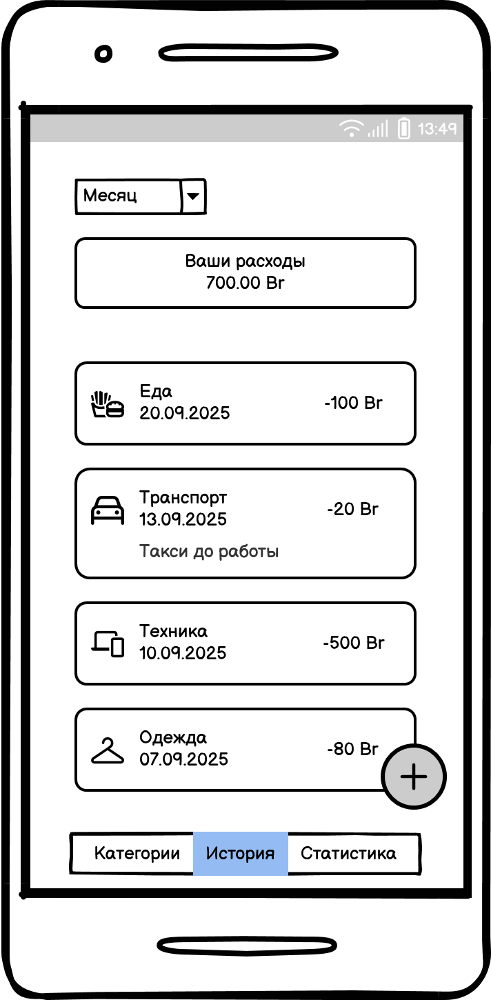
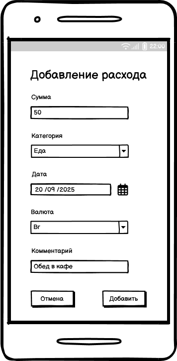
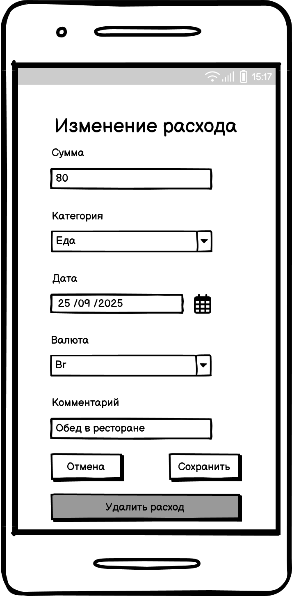
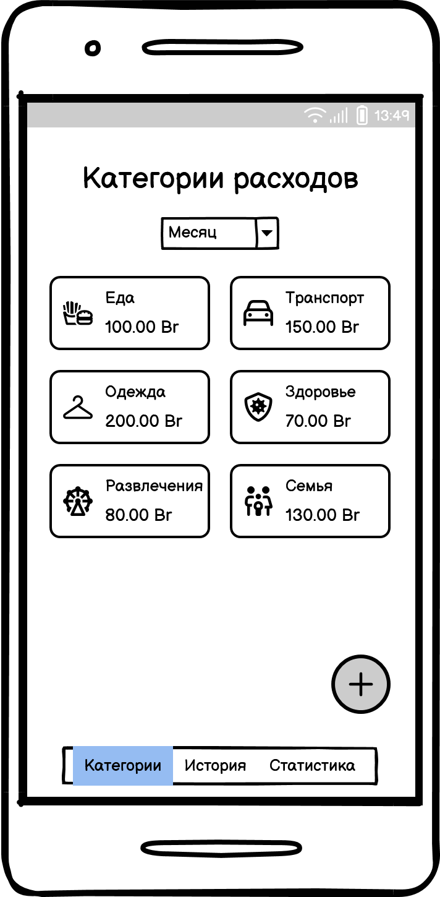
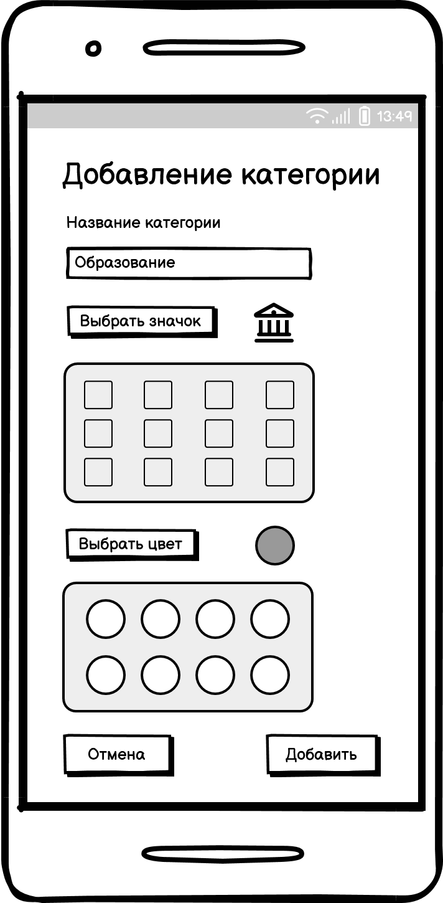
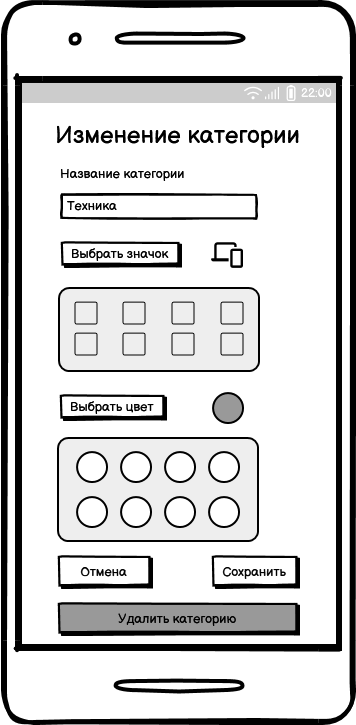
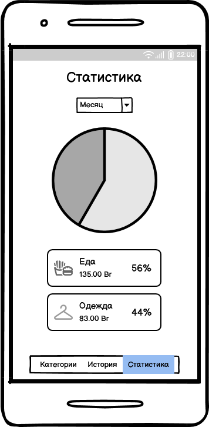

# Требования к проекту
---

# Содержание

1 [Введение](#1-введение)  
1.1 [Назначение](#11-назначение)  
1.2 [Бизнес требования](#12-бизнес-требования)  
1.2.1 [Исходные данные](#121-исходные-данные)  
1.2.2 [Возможности бизнеса](#122-возможности-бизнеса)  
1.2.3 [Границы проекта](#123-границы-проекта)  
1.3 [Аналоги](#13-аналоги)  
2 [Требования пользователя](#2-требования-пользователя)  
2.1 [Программные интерфейсы](#21-программные-интерфейсы)  
2.2 [Интерфейс пользователя](#22-интерфейс-пользователя)  
2.3 [Характеристики пользователей](#23-характеристики-пользователей)  
2.3.1 [Классы пользователей](#231-классы-пользователей)  
2.3.2 [Аудитория приложения](#232-аудитория-приложения)  
2.3.2.1 [Целевая аудитория](#2321-целевая-аудитория)  
2.3.2.2 [Побочная аудитория](#2322-побочная-аудитория)  
2.4 [Предположения и зависимости](#24-предположения-и-зависимости)  
3 [Системные требования](#3-системные-требования)  
3.1 [Функциональные требования](#31-функциональные-требования)  
3.1.1 [Основные функции](#311-основные-функции)  
3.1.1.1 [Добавление расхода](#3111-добавление-расхода)  
3.1.1.2 [Изменение и удаление расходов](#3112-изменение-и-удаление-расходов)  
3.1.1.3 [Просмотр истории расходов](#3113-просмотр-истории-расходов)  
3.1.1.4 [Отображение категорий расходов](#3114-отображение-категорий-расходов)  
3.1.1.5 [Управление категориями расходов](#3115-управление-категориями-расходов)  
3.1.1.6 [Просмотр статистики расходов](#3116-просмотр-статистики-расходов)  
3.1.2 [Ограничения и исключения](#312-ограничения-и-исключения)  
3.2 [Нефункциональные требования](#32-нефункциональные-требования)  
3.2.1 [Атрибуты качества](#321-атрибуты-качества)  
3.2.1.1 [Требования к удобству использования](#3211-требования-к-удобству-использования)  
3.2.1.2 [Требования к безопасности](#3212-требования-к-безопасности)  
3.2.1.3 [Требования к доступности](#3213-требования-к-доступности)  
3.2.2 [Внешние интерфейсы](#322-внешние-интерфейсы)  
3.2.3 [Ограничения](#323-ограничения)

# 1 Введение

## 1.1 Назначение
В этом документе описаны функциональные и нефункциональные требования к приложению «Spendly» для ОС Android. Данный документ предназначен для команды, которая будет реализовывать и проверять корректность работы приложения.

## 1.2 Бизнес-требования

### 1.2.1 Исходные данные
Многие люди хотят вести учёт личных расходов. У каждого есть финансовые привычки, категории трат и цели. В повседневной жизни часто возникает потребность быстро записать какую-либо трату (например, поездка на такси или покупка продуктов), чтобы позже проанализировать расходы.  
Однако пользователям приходится использовать либо слишком сложные финансовые приложения, требующие регистрации и подключения к банковским сервисам, либо вручную вести записи в таблицах или вовсе в бумажном варианте, что неудобно и занимает много времени.

### 1.2.2 Возможности бизнеса
Многие пользователи заинтересованы в простом и удобном приложении для учёта расходов, которое не требует специальных знаний или сложных действий. Такое приложение позволит им экономить время, отслеживать свои траты и планировать бюджет.  
Наличие функции категорий расходов с возможностью установки значков и цветов, функции добавления комментариев, а также экрана со статистикой делает процесс учёта более наглядным и понятным.  
Также поддержка возможности добавления расходов в нескольких валютах с последующим переводом в основную повысит привлекательность приложения для более широкой аудитории (туристов, фрилансеров и других).  
Приложение может быть полезно людям разных возрастов и с любым уровнем технической подготовки, благодаря простому интерфейсу. Возможность использовать приложение без регистрации повысит его привлекательность для широкой аудитории.

### 1.2.3 Границы проекта
Приложение «Spendly» позволит пользователям вести учёт своих трат, просматривать их в разрезе категорий и анализировать расходы за выбранный период времени. Также позволит пользователям добавлять траты в разных валютах и автоматически конвертировать их в основную валюту с использованием курса валют из стороннего сервиса. Добавление записей будет доступно без регистрации.

## 1.3 Аналоги
Аналогами являются такие приложения для подсчета расходов, как CoinKeeper, ZenMoney, Money Lover. Их особенностью является то, что они позволяют вести подробный учёт расходов и доходов, отображают статистику в виде диаграмм и позволяют синхронизировать данные с банковскими счетами. Недостатком этих приложений является перегруженность интерфейса и необходимость регистрации или подписки. Кроме того, для простого учёта трат такие решения могут оказаться слишком сложными.

# 2 Требования пользователя

## 2.1 Программные интерфейсы
Для получения актуальных курсов валют в приложении будет использоваться внешний сервис [ExchangeRate-API](https://www.exchangerate-api.com/docs/overview). Он предоставляет API, позволяющий конвертировать значения из одной валюты в другую. Доступ к данным осуществляется через HTTP-запросы. Данный интерфейс будет использоваться для пересчёта сумм расходов в единую базовую валюту.

## 2.2 Интерфейс пользователя
Главный экран приложения, на котором отображается история расходов за выбранный период времени, а также есть возможность добавления нового расхода  

  

Экран добавления расхода  

 

Экран изменения и удаления расхода  

  

Экран, который отображает все категории расходов, суммы по категориям за выбранный период времени, а также позволяет добавить, изменить или удалить категорию  

  

Экран добавления категории  

  

Экран изменения и удаления категории  

  

Экран со статистикой расходов за выбранный период времени  

  

## 2.3 Характеристики пользователей

### 2.3.1 Классы пользователей

| Класс пользователей | Описание |
|:---|:---|
| Обычные пользователи | Пользователи, которые используют приложение для базового учёта расходов. Они используют возможность добавлять расходы с указанием суммы, категории и даты, просматривать список расходов, а также статистику за выбранный период. |
| Пользователи расширенного функционала | Пользователи, которые помимо базовых функций используют расширенные возможности приложения. К ним относятся выбор валюты при добавлении расходов, автоматическая конвертация сумм в основную валюту, добавление комментариев к отдельным расходам и добавление собственных категорий.|

### 2.3.2 Аудитория приложения

#### 2.3.2.1 Целевая аудитория
Люди, желающие вести учёт своих личных расходов. К ним относятся пользователи, которые хотят быстро и удобно анализировать расходы по категориям и периодам, а также при необходимости использовать разные валюты. Приложение рассчитано на широкую аудиторию без ограничений по возрасту и уровню технической подготовки.

#### 2.3.2.2 Побочная аудитория
Пользователи, которые не ведут регулярный учёт расходов, но время от времени хотят записать отдельные расходы, например, во время поездок, командировок или при покупках в иностранной валюте.

## 2.4 Предположения и зависимости
Приложение не может производить конвертацию валюты при добавлении расходов без подключения к Интернету, так как для получения курсов валют используется интернет-ресурс.

# 3 Системные требования

## 3.1 Функциональные требования

### 3.1.1 Основные функции

#### 3.1.1.1 Добавление расхода
Пользователь имеет возможность добавить новый расход, указав сумму, категорию, дату, валюту и, при необходимости, комментарий.

| Функция | Требования | 
|:---|:---|
| Ввод суммы | Приложение должно предоставить пользователю поле для ввода суммы расхода. |
| Выбор категории | Приложение должно предоставить пользователю возможность выбрать категорию из списка доступных. |
| Выбор даты | Приложение должно позволять указать дату вручную или выбрать текущую автоматически. |
| Выбор валюты | Приложение должно предоставить возможность выбрать валюту. При необходимости сумма должна быть сконвертирована в основную валюту через интернет-ресурс ExchangeRate-API. |
| Добавление комментария | Приложение должно позволять при необходимости добавить текстовый комментарий к расходу. |
| Сохранение записи | Приложение должно сохранить внесённые данные и отобразить их в списке расходов. |

#### 3.1.1.2 Изменение и удаление расходов
Пользователь может изменять и удалять расходы.
 
| Функция | Требования | 
|:---|:---|
| Изменение расхода | Приложение должно позволять редактировать сумму, категорию, дату, валюту и комментарий существующего расхода. |
| Удаление расхода | Приложение должно позволять удалить расход. |

#### 3.1.1.3 Просмотр истории расходов
Пользователь имеет возможность просматривать список ранее добавленных расходов с фильтрацией по времени.

| Функция | Требования | 
|:---|:---|
| Просмотр списка расходов | Приложение должно отобразить список расходов пользователя за выбранный промежуток времени. |
| Фильтрация по времени | Приложение должно предоставить пользователю возможность фильтровать расходы за сегодня, неделю, месяц или всё время. |
| Просмотр деталей | Приложение должно отобразить подробности расхода (сумма, дата, категория, комментарий, валюта). |

#### 3.1.1.4 Отображение категорий расходов
Пользователь может просмотреть все существующие категории расходов, а также сумму по каждой категории за выбранный промежуток времени. 

| Функция | Требования |
| ---------------------------------- | ---------------------------------------------------------------------------------------------------------------------------------- |
| Просмотр списка категорий          | Приложение должно отобразить список всех категорий расходов пользователя.                                                          |
| Фильтрация по времени              | Приложение должно предоставить пользователю возможность фильтровать расходы по категориям за сегодня, неделю, месяц или всё время. |
| Отображение расходов по категориям | Приложение должно отобразить расходы по категориям за выбранный промежуток времени.                                                |

#### 3.1.1.5 Управление категориями расходов
Пользователь может создавать, изменять и удалять категории расходов.

| Функция             | Требования                                                                                                       |
| ------------------- | ---------------------------------------------------------------------------------------------------------------- |
| Создание категории  | Приложение должно предоставить пользователю возможность добавить новую категорию с названием, значком и цветом.  |
| Изменение категории | Приложение должно позволять редактировать название, значок и цвет существующей категории.                        |
| Удаление категории  | Приложение должно позволять удалить категорию. При этом расходы из неё должны быть помечены как «Без категории». |

#### 3.1.1.6 Просмотр статистики расходов
Пользователь должен иметь возможность просматривать статистику расходов за выбранный период времени.

| Функция                               | Требования                                                                                                                                                                     |
| ------------------------------------- | ------------------------------------------------------------------------------------------------------------------------------------------------------------------------------ |
| Фильтрация по времени                 | Приложение должно предоставить пользователю возможность фильтровать расходы за сегодня, неделю, месяц или всё время.                                                           |
| Отображение расходов в виде диаграммы | Приложение должно отобразить расходы по категориям в виде диаграммы, а также указать процент расходов по каждой категории от общей суммы расходов за выбранный период времени. |

### 3.1.2 Ограничения и исключения
Приложение может производить конвертацию валюты при добавлении расходов только при наличии подключения к Интернету.

## 3.2 Нефункциональные требования

### 3.2.1 Атрибуты качества

#### 3.2.1.1 Требования к удобству использования
Приложение должно реализовывать все описанные функции. Все функциональные элементы пользовательского интерфейса должны иметь понятное назначение, а сам интерфейс не должен содержать лишних элементов.

#### 3.2.1.2 Требования к безопасности
Доступ к данным пользователя (история расходов, категории) осуществляется только локально на устройстве. Приложение не передаёт пользовательские данные на внешние серверы.

#### 3.2.1.3 Требования к доступности
1. Время реакции на действия пользователя должно быть минимальным, обеспечивая плавную и отзывчивую работу интерфейса.
2. Приложение должно корректно функционировать на устройствах с различными характеристиками (размер экрана, производительность, версия ОС).
3. Элементы управления должны быть достаточно крупными и читаемыми для комфортного взаимодействия.

### 3.2.2 Внешние интерфейсы
1. Пользовательский интерфейс (UI): Приложение предоставляет графический интерфейс, адаптированный для мобильных устройств на ОС Android. 
2. Интерфейс хранения данных: Все пользовательские данные сохраняются локально на устройстве.
3. Интерфейс внешних API: для конвертации расходов в базовую валюту используется ExchangeRate-API.

### 3.2.3 Ограничения
1. Приложение предназначено для работы только на мобильных устройствах с операционной системой Android.
2. Все данные хранятся локально на устройстве, облачная синхронизация не поддерживается.
