## Содержание 
1. [Глоссарий ключевых понятий](#1-глоссарий-ключевых-понятий)
2. [Диаграмма классов](#2-диаграмма-классов)    
3. [Диаграмма вариантов использования (Use Case)](#3-диаграмма-вариантов-использования-use-case)  
4. [Потоки событий (Flow of Events)](#4-потоки-событий-flow-of-events)  
5. [Диаграммы активностей](#5-диаграммы-активностей)  
6. [Диаграммы последовательности](#6-диаграммы-последовательности)  
7. [Диаграмма состояний](#7-диаграмма-состояний)  
8. [Диаграмма компонентов](#8-диаграмма-компонентов)  
9. [Диаграмма развёртывания](#9-диаграмма-развёртывания)  

---

## 1. Глоссарий ключевых понятий

| Понятие | Описание |
|----------|-----------|
| **Расход (Expense)** | Запись о трате пользователя с указанием суммы, даты, категории и комментария. |
| **Категория (Category)** | Группа расходов по общему признаку (например, «Еда», «Транспорт», «Развлечения»). |
| **Валюта (Currency)** | Денежная единица, используемая для расчёта расходов. |
| **Курс валют (Exchange Rate)** | Отношение одной валюты к другой, получаемое через API. |
| **История расходов (Expense History)** | Хронологический список всех добавленных расходов. |
| **Статистика (Statistics)** | Аналитическое представление расходов в виде диаграммы. |
| **Пользователь (User)** | Актёр, взаимодействующий с системой. |

---

## 2. Диаграмма классов

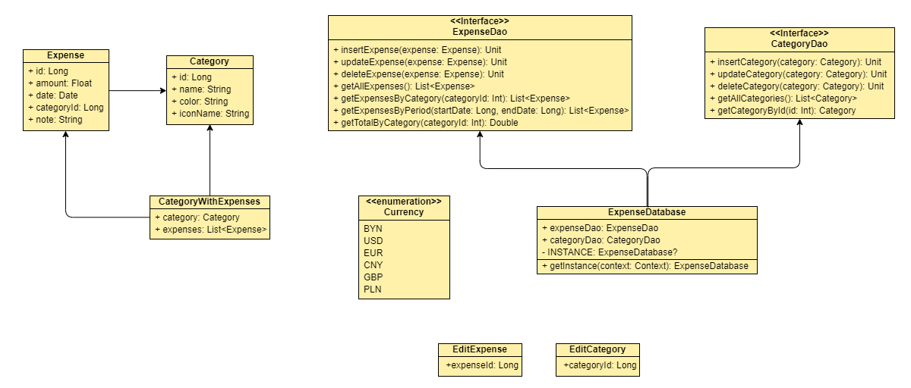

---

## 3. Диаграмма вариантов использования (Use Case)

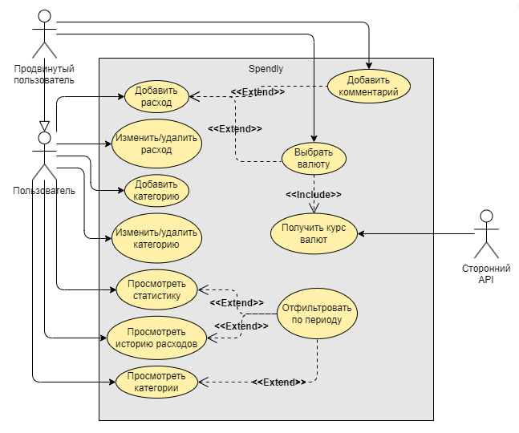

### Актёры системы
- **Пользователь** — основной актёр, взаимодействующий с приложением.
- **Продвинутый пользователь** - пользователь, использующий расширенный функционал.
- **Сторонний API ([ExchangeRate-API](https://www.exchangerate-api.com/docs/overview))** — внешний сервис для получения курсов валют.

---

## 4. Потоки событий (Flow of Events)

## Вариант использования «Добавить расход»  
**Описание.**  
Вариант использования «Добавить расход» позволяет пользователю добавить новый расход, указав сумму, валюту, дату, категорию и комментарий.  

**Предусловия.**  
1. Пользователь находится на главном экране или экране истории расходов.  
2. Есть активное подключение к Интернету.  

**Основной поток событий.**  
1. Приложение отображает главный экран или экран истории расходов.  
2. Пользователь нажимает на кнопку для добавления нового расхода.  
3. Приложение отображает окно добавления расхода с полями для ввода данных.  
4. Пользователь вводит сумму, выбирает категорию, дату и валюту, добавляет комментарий.  
5. Пользователь нажимает кнопку **«Сохранить»**.  
6. Приложение проверяет корректность введенных данных и при обнаружении ошибок выполняется альтернативный поток **А1**.  
7. Приложение при необходимости делает запрос к стороннему API для получения курса валют. При ошибке отправки запроса выполняется поток ошибки **Е1**.  
8. Приложение сохраняет новый расход в базе данных и обновляет историю расходов.  
9. Вариант использования завершается.  

**Альтернативный поток А1.**  
1. Если пользователь не заполнил обязательные поля или ввел некорректные данные, приложение отображает сообщение об ошибке.  
2. Возврат к пункту 3 основного потока.  

**Поток ошибки Е1.**  
1. Приложение уведомляет пользователя, что невозможно получить актуальный курс валют.  
2. Приложение предлагает выбрать основную валюту.  
3. Возврат к пункту 3 основного потока.  

**Постусловия.**
- Переход к варианту использования «Просмотреть историю расходов».  

---

## Вариант использования «Изменить/удалить расход»  
**Описание.**  
Вариант использования «Изменить/удалить расход» позволяет пользователю изменить ранее добавленный расход или удалить его.  

**Предусловия.**  
1. В приложении уже есть добавленные расходы.  
2. Пользователь находится на экране истории расходов.  

**Основной поток событий.**  
1. Приложение отображает список расходов.  
2. Пользователь выбирает нужный расход.  
3. Приложение открывает экран редактирования/удаления расхода.  
4. Пользователь изменяет данные или выбирает действие **«Удалить»**.  
5. Пользователь нажимает на кнопку **«Сохранить»**.  
6. Приложение производит проверку корректности новых данных и при обнаружении ошибок выполняется альтернативный поток **А1**.  
7. Приложение выполняет выбранное действие и обновляет историю расходов.  
8. Вариант использования завершается.  

**Альтернативный поток А1.**  
1. Если пользователь не заполнил обязательные поля или ввел некорректные данные, приложение отображает сообщение об ошибке.  
2. Возврат к пункту 3 основного потока.  

**Постусловия.**  
- Переход к варианту использования «Просмотреть историю расходов».  

---

## Вариант использования «Добавить категорию»  
**Описание.**  
Вариант использования «Добавить категорию» позволяет пользователю создать новую категорию расходов, указав ее название, иконку и цвет.  

**Предусловия.**  
Пользователь находится на экране категорий.  

**Основной поток событий.**  
1. Приложение отображает список существующих категорий.  
2. Пользователь нажимает на кнопку **«Добавить категорию»**.  
3. Приложение отображает экран добавления категории с полями для ввода данных.  
4. Пользователь вводит название, выбирает иконку и цвет.  
5. Пользователь нажимает на кнопку **«Сохранить»**.  
6. Приложение проверяет корректность данных и при обнаружении ошибок выполняется альтернативный поток **А1**.  
7. Приложение сохраняет новую категорию и обновляет список.  
8. Вариант использования завершается.  

**Альтернативный поток А1.**  
1. Если пользователь не заполнил какое-либо поле, ввел некорректные данные или ввел дублирующееся название, то приложение отображает сообщение об ошибке.
2. Возврат к пункту 3 основного потока.  

**Постусловия.**  
- Переход к варианту использования «Просмотреть категории».  

---

## Вариант использования «Изменить/удалить категорию»  
**Описание.**  
Вариант использования «Изменить/удалить категорию» позволяет пользователю изменить название, иконку или цвет категории, а также удалить ее.  

**Предусловия.**  
Пользователь находится на экране категорий.  

**Основной поток событий.**  
1. Приложение отображает список категорий.  
2. Пользователь выбирает нужную категорию.  
3. Приложение открывает экран редактирования/удаления категории.  
4. Пользователь изменяет данные или выбирает удаление категории нажатием на кнопку **«Удалить»**.  
5. Приложение производит проверку корректности новых данных и при обнаружении ошибок выполняется альтернативный поток **А1**.  
6. Приложение выполняет изменение или удаление категории и обновляет список.  
7. Вариант использования завершается.  

**Альтернативный поток А1.**  
1. Если пользователь не заполнил какое-либо поле или ввел некорректные данные или ввел дублирующееся название, то приложение отображает сообщение об ошибке.
2. Возврат к пункту 3 основного потока.

**Постусловия.**   
- Все расходы удаленной категории перенесены в категорию **«Без категории»**.  
- Переход к варианту использования "Просмотреть категории"   

---

## Вариант использования «Просмотреть статистику»  
**Описание.**  
Вариант использования «Просмотреть статистику» позволяет пользователю анализировать расходы по категориям за выбранный период в виде диаграммы.  

**Предусловия.**  
- Приложение содержит данные о расходах за выбранный период времени.  

**Основной поток событий.**  
1. Пользователь открывает экран статистики.  
2. Приложение отображает диаграмму расходов по категориям за выбранный по умолчанию период времени.  
3. Пользователь изменяет период времени для анализа.  
4. Приложение обновляет данные диаграммы.  
5. Вариант использования завершается.  

---

## Вариант использования «Просмотреть историю расходов»  
**Описание.**  
Вариант использования «Просмотреть историю расходов» позволяет пользователю просматривать список всех ранее добавленных расходов.  

**Предусловия.**  
1. Пользователь находится на главном экране (экране с историей расходов).  
2. Приложение содержит данные о расходах за выбранный период времени.  

**Основной поток событий.**  
1. Приложение отображает список расходов.  
2. Пользователь может пролистывать список или использовать фильтры по периоду времени.  
3. Приложение отображает расходы, соответствующие выбранному фильтру.  
4. Вариант использования завершается.  

---

## Вариант использования «Просмотреть категории»  
**Описание.**  
Вариант использования «Просмотреть категории» позволяет пользователю увидеть все существующие категории расходов и суммы, потраченные в каждой из них за выбранный период времени.  

**Предусловия.**  
- Пользователь находится на экране категорий.  

**Основной поток событий.**  
1. Приложение отображает список категорий и суммы расходов по каждой из них за выбранный период времени.  
2. Пользователь может изменить период времени, чтобы обновить данные.  
3. Приложение обновляет отображение.  
4. Вариант использования завершается.  

---

## Вариант использования «Добавить комментарий»  
**Описание.**  
Вариант использования «Добавить комментарий» позволяет пользователю добавить пояснение или заметку к отдельному расходу.  

**Предусловия.**  
- Пользователь находится на экране добавления или редактирования расхода.  

**Основной поток событий.**  
1. Приложение отображает поле для ввода комментария.  
2. Пользователь вводит текст комментария.  
3. Пользователь сохраняет изменения нажатием на кнопку **«Сохранить»**.  
4. Приложение добавляет комментарий к расходу.  
5. Вариант использования завершается.  

**Постусловия.**   
- Переход к варианту использования «Просмотреть историю расходов».  

---

## Вариант использования «Выбрать валюту»  
**Описание.**  
Вариант использования «Выбрать валюту» позволяет пользователю указать валюту при добавлении или редактировании расхода.  

**Предусловия.**  
1. Пользователь находится на экране добавления или редактирования расхода.  
2. Устройство подключено к Интернету.  

**Основной поток событий.**  
1. Приложение отображает список доступных валют.  
2. Пользователь выбирает нужную валюту.  
3. Приложение сохраняет выбор и при необходимости делает запрос к API для конвертации.  
   Если возникает ошибка при отправке запроса, выполняется поток ошибки **Е1**.  
4. Вариант использования завершается.  

**Поток ошибки Е1.**  
1. Приложение уведомляет пользователя, что невозможно получить актуальный курс валют.  
2. Приложение предлагает выбрать основную валюту.  
3. Возврат к пункту 1 основного потока.  

**Постусловия.**  
- Переход к варианту использования «Просмотреть историю расходов».    

---

## Вариант использования «Отфильтровать по периоду»  
**Описание.**  
Вариант использования «Отфильтровать по периоду» позволяет пользователю просматривать расходы или статистику за выбранный промежуток времени.  

**Предусловия.**  
- Пользователь находится на экране истории расходов, статистики или на экране категорий.  

**Основной поток событий.**  
1. Приложение отображает фильтр по периодам.  
2. Пользователь выбирает вариант: **сегодня**, **неделя**, **месяц** или **все время**.  
3. Приложение обновляет отображаемые данные.  
4. Вариант использования завершается.  

---

## Вариант использования «Получить курс валют»  
**Описание.**  
Вариант использования «Получить курс валют» позволяет приложению получить актуальный курс валют для пересчета расходов из одной валюты в другую.  

**Предусловия.**  
- Устройство подключено к Интернету.  

**Основной поток событий.**  
1. Приложение отправляет запрос к [ExchangeRate-API](https://www.exchangerate-api.com/docs/overview).  
   Если возникает ошибка при отправке запроса, выполняется поток ошибки **Е1**.  
2. Сервис возвращает данные с актуальными курсами валют.  
3. Приложение использует данные для дальнейших вычислений.  
4. Вариант использования завершается.  

**Поток ошибки Е1.**  
1. Приложение отображает сообщение об ошибке отправки запроса на получение курса валют.
2. Вариант использования завершается. 

---

## 5. Диаграммы активностей

**Диаграмма активностей для вариантов использования «Добавить расход», «Изменить расход», «Удалить расход»**  
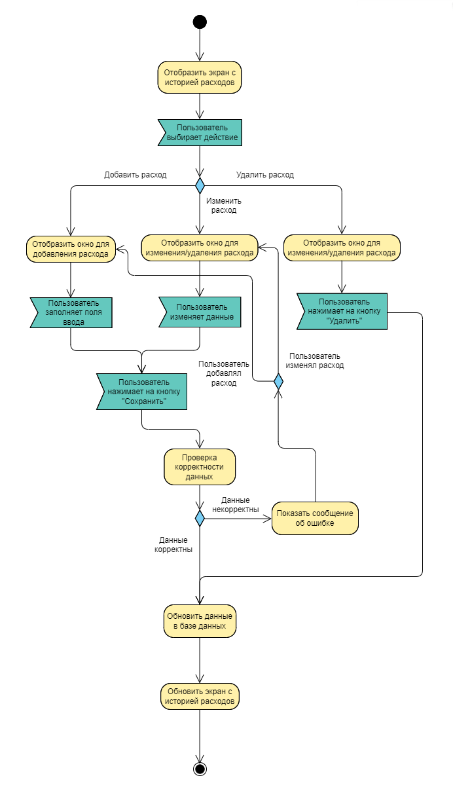

**Диаграмма активностей для варианта использования «Просмотреть статистику»**  
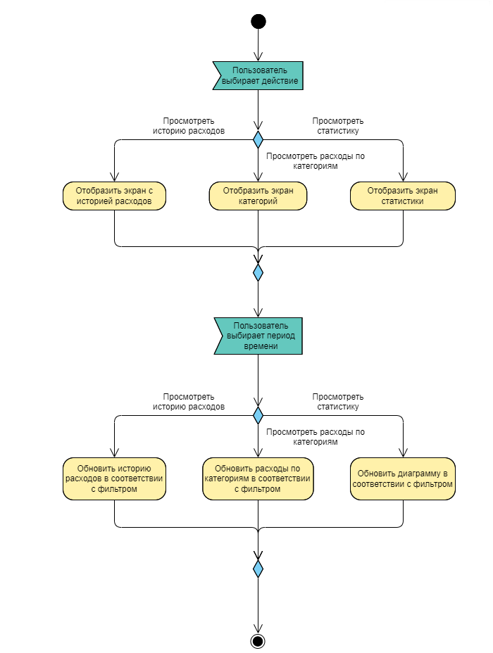

**Диаграмма активностей для вариантов использования «Добавить категорию», «Изменить категорию», «Удалить категорию»**
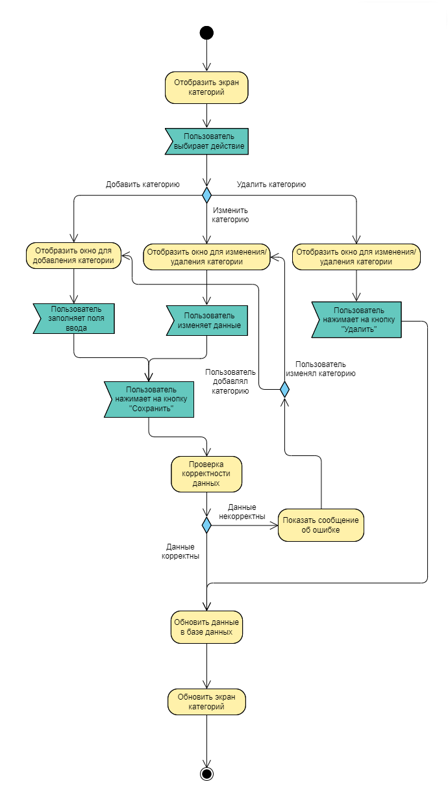

---

## 6. Диаграммы последовательности

**Диаграмма последовательности для варианта использования «Добавить расход»**  
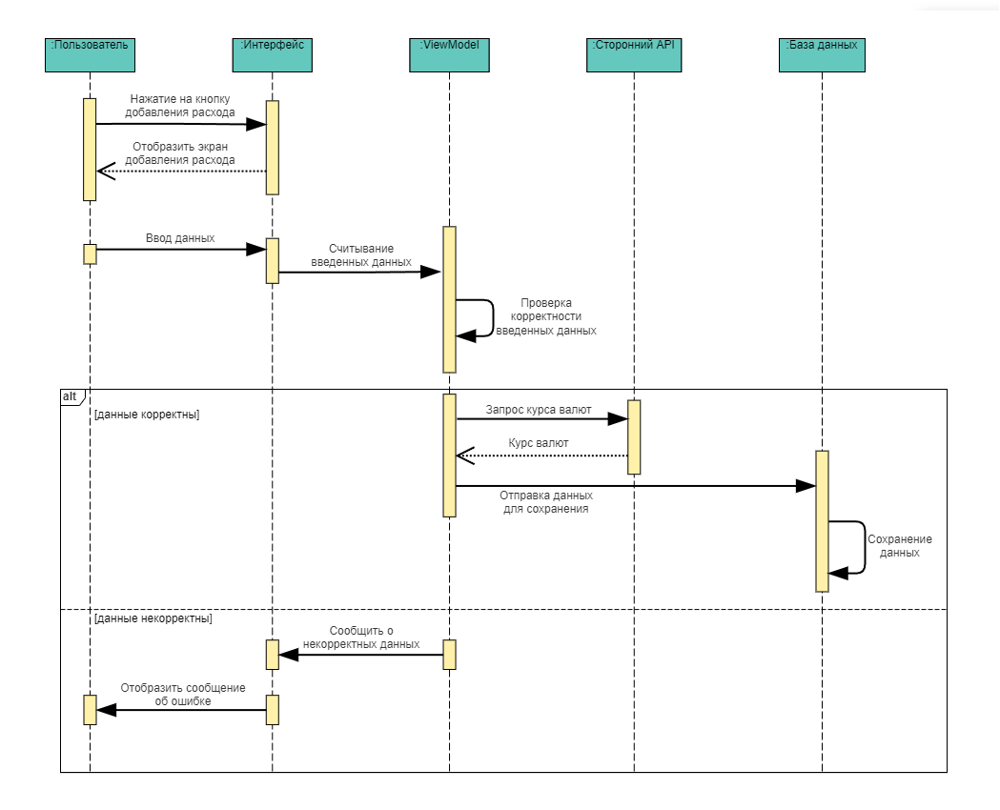

**Диаграмма последовательности для варианта использования «Изменить расход»**  
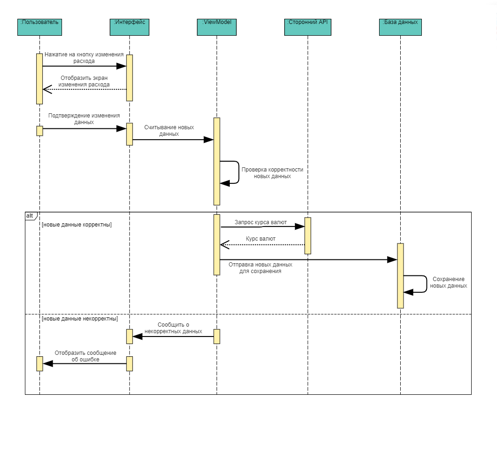

**Диаграмма последовательности для варианта использования «Удалить расход»** 
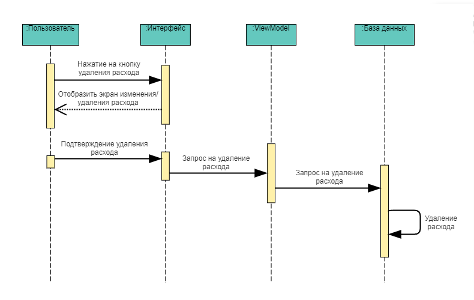

**Диаграмма последовательности для варианта использования «Добавить категорию»**  
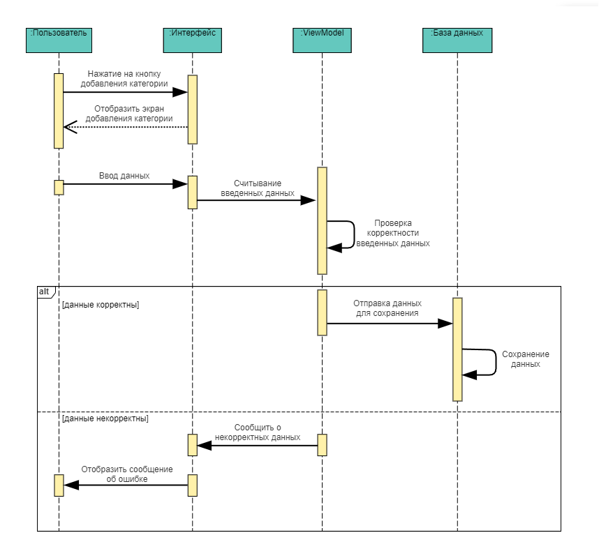

**Диаграмма последовательности для варианта использования «Изменить категорию»**  
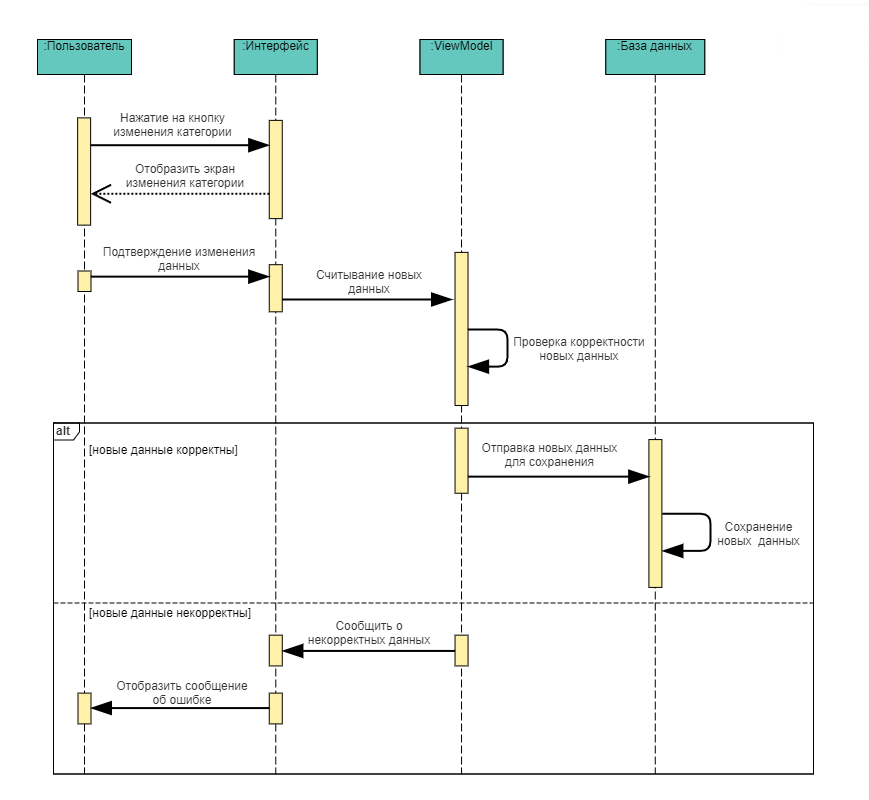

**Диаграмма последовательности для варианта использования «Удалить категорию»**
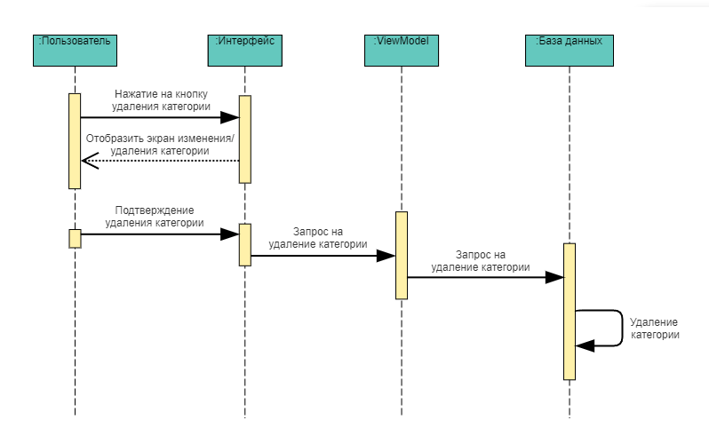

**Диаграмма последовательности для варианта использования «Просмотреть статистику»**  
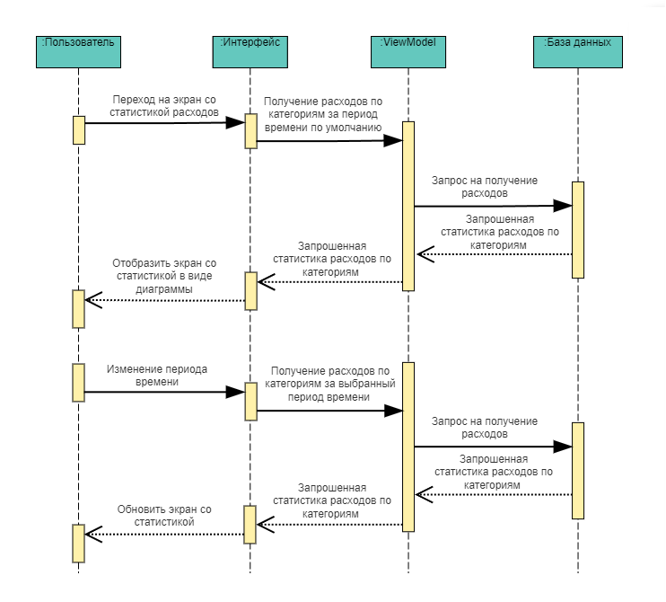

**Диаграмма последовательности для варианта использования «Просмотреть историю расходов»**
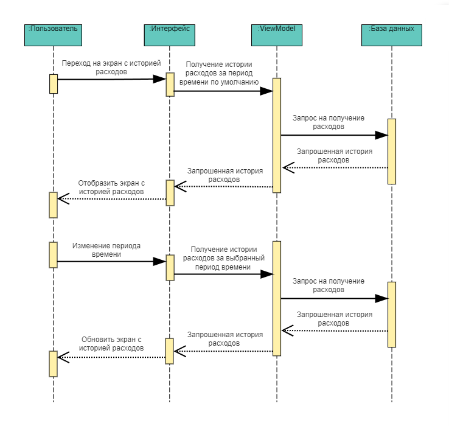

**Диаграмма последовательности для варианта использования «Просмотреть категории»**
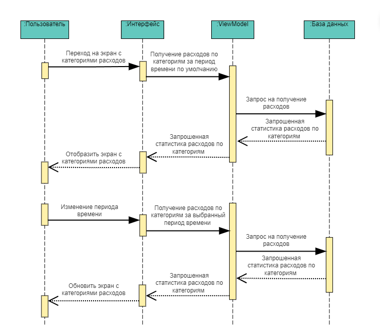

---

## 7. Диаграммы состояний

**Диаграмма состояний приложения**  
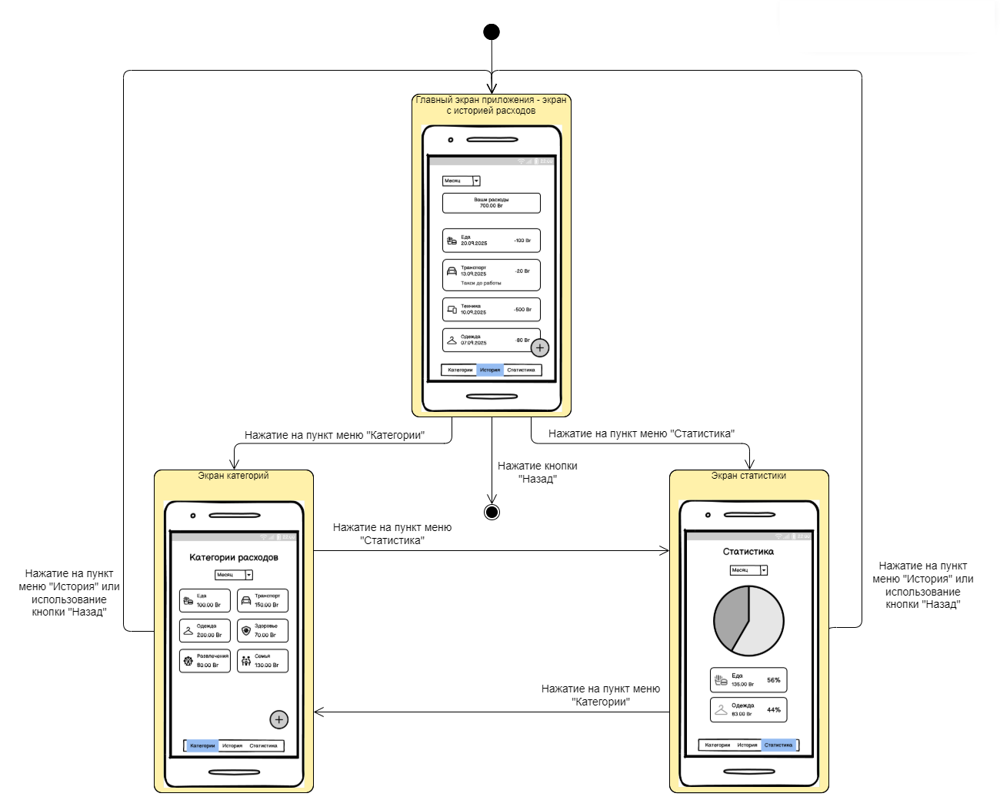

**Диаграмма состояний приложения для вариантов использования «Добавить расход», «Изменить расход», «Удалить расход»**  
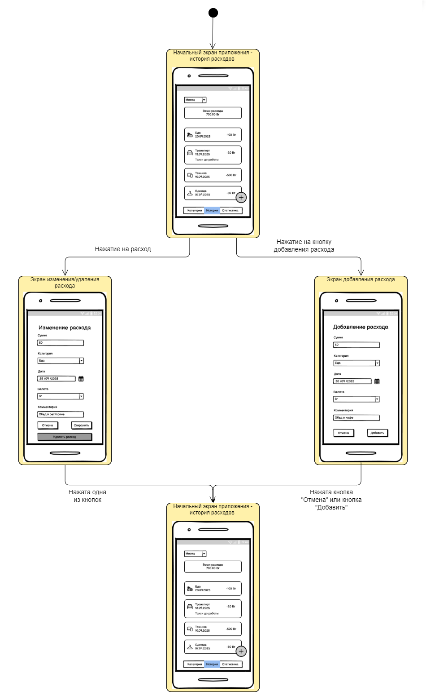

**Диаграмма состояний приложения для вариантов использования «Добавить категорию», «Изменить категорию», «Удалить категорию»**  
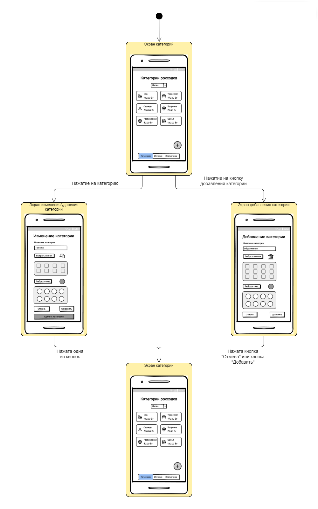

---

## 8. Диаграмма компонентов
 
Основные компоненты:
- **Представление**  
- **Модель представления**  
- **Модель**  
- **База данных Room**  
- **External API ([ExchangeRate-API](https://www.exchangerate-api.com/docs/overview))**  

**Диаграмма компонентов приложения**  
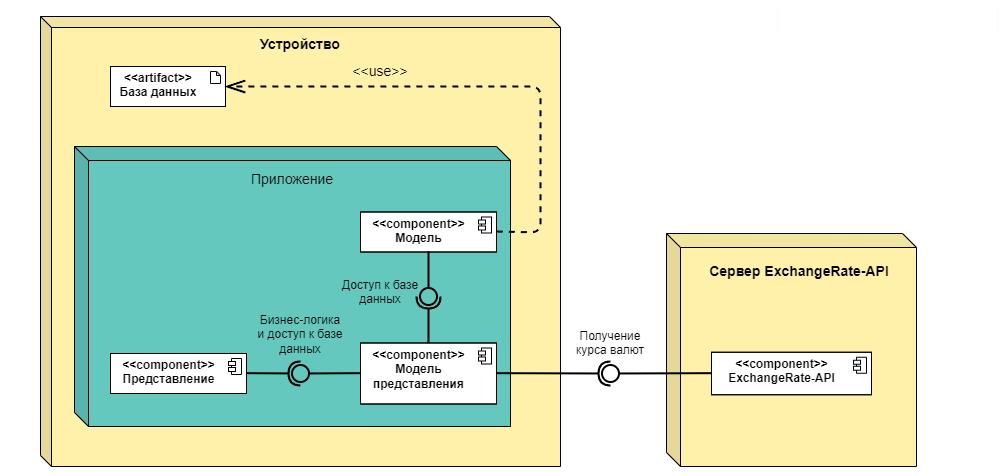

---

## 9. Диаграмма развёртывания
 
В системе участвуют:
- **Мобильное устройство пользователя**   
- **Android**
  - Приложение Spendly  
  - Локальная база данных Room 
- **Внешний сервер API (ExchangeRate-API)**  

**Диаграмма развёртывания**  
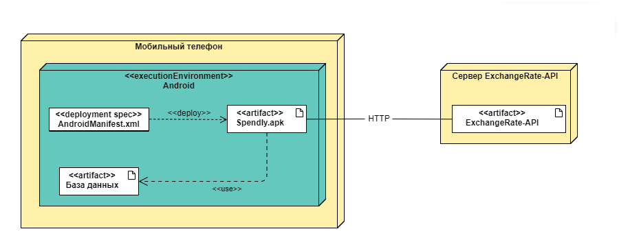

---

